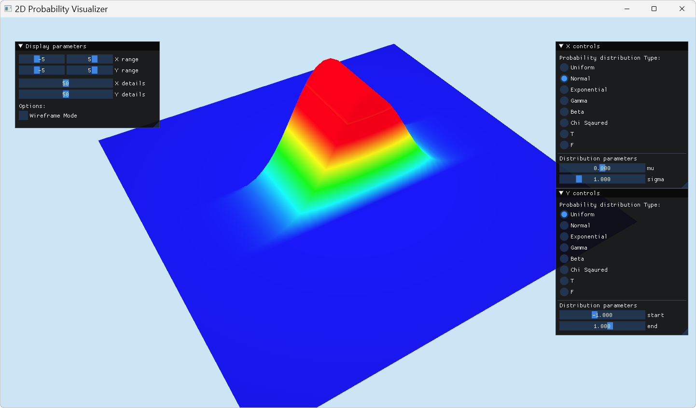

# 2D-Probability-Visualizer

C++/OpenGL Probability visualizer made using GLFW and Dear ImGui. Supports various probability distributions:
1. Uniform distribution
2. Gaussian distribution
3. Exponential distribution
4. Gamma distribution
5. Beta distribution
6. Chi-squared distribution
7. T distribution
8. F distribution

Supports the modification of parameters, and real-time updates of functions.

Comes with UI and mouse controls such as map rotation and scroll to zoom.

Built out of another project [GeoGraphix](https://github.com/oliverbaileysmith/GeoGraphix)
